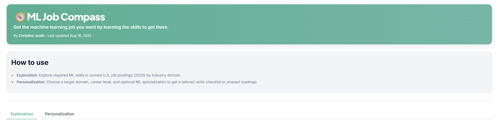
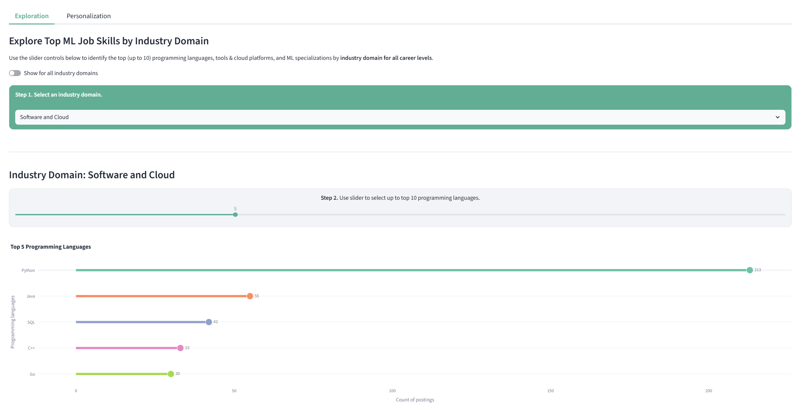
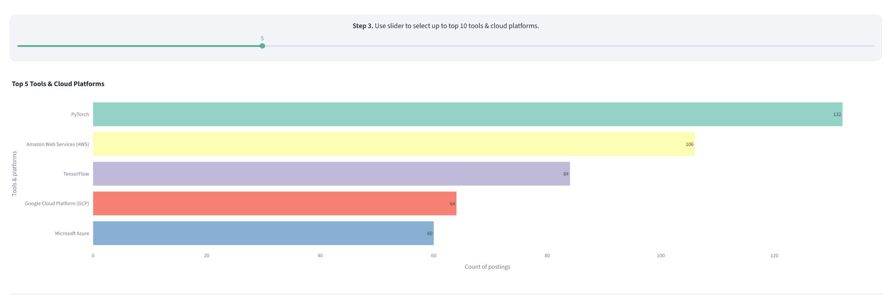
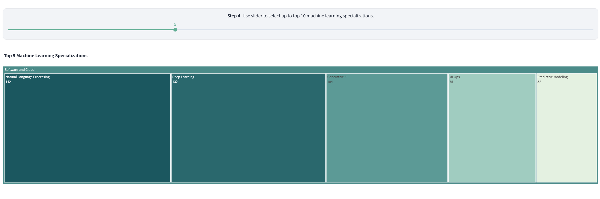
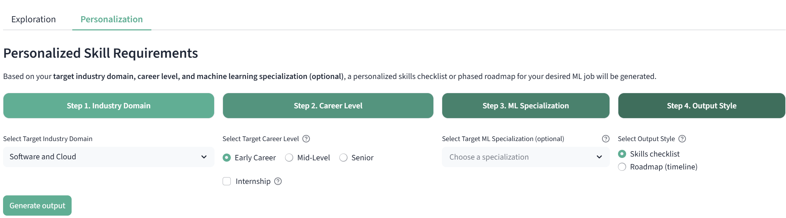

# 🧭 ML Job Compass 
## *Get the machine learning job you want by learning the skills to get there.*
**Author:** Christina Joslin

Are you a college student interested in getting involved in machine learning (ML) but don’t know where to start?  Early in your ML career and want to prepare for mid-level roles? Or aiming at senior/executive-track ML positions? **ML Job Compass** helps you chart the path to your desired ML role. Using **Natural Language Processing (NLP)**, **Data Visualization**, **Large Language Models (LLMs)**, and **Retrieval-Augmented Generation (RAG)**, the app lets you:
#### 1. Explore required ML skills in current U.S. job postings (2025) by industry domain.  
#### 2. Choose a target domain, career level, and optional ML specialization to get a tailored *skills checklist* or *phased roadmap*.

---

## Features

- **Exploration (by domain):** Top programming languages, frameworks/tools & cloud platforms, ML specializations.
- **Personalization:** Pick your target domain, level (Early/Mid/Senior), and optional specialization; get either:
  - **Skills checklist** (3–5 items with what/why/mini-project/resources), or
  - **Phased roadmap** (foundations &rarr; core projects &rarr; portfolio/interview, with named resources).
- **RAG-backed guidance:** Uses a local Chroma vector store of real job snippets to ground suggestions.

---

## Prerequisites

#### **Step 1:** Install **[Ollama](https://ollama.com/download)** on your local machine.
#### **Step 2:** Pull an Ollama model for inference:
  - **GPU recommended:** `ollama pull granite3.3:8b` (Granite-3.3-8B-Instruct).  
> Inference speed and instruction-following quality were evaluated across several models (including the latest GPT OSS 20B model). Empirically, **Granite-3.3-8B-Instruct** was a solid default for this application.

  - **CPU-only option:** `ollama pull granite3.1:2b` (smaller model, slower but workable).
#### **Step 3 (if using containers):** Install **[Docker Desktop](https://www.docker.com/products/docker-desktop)**

#### **Step 4:** Create a `.env` file  
- Copy `sample.env` into `.env` and set values for:  
  ```env
  MODEL_ID=granite3.3:8b
  OLLAMA_BASE_URL=http://localhost:11434
  ```
> **Hardware note:** Aim for ~16 GB RAM and, ideally, a **NVIDIA GeForce RTX GPU** (author tested on RTX 4070).

> ⚠️**Image size note:** The base CUDA/PyTorch image used for RAG (i.e., top-k similarity search during inference) is large ( $\approx$ **15.35 GB**). Ensure sufficient disk space.

---

## Deployment Options 

There are two ways to run the app, both relying on **Ollama running locally:**

- **Option 1 (Docker Compose):**  
  Runs a single container hosting the **Streamlit app**. The app makes HTTP calls to the **local Ollama server** (`OLLAMA_BASE_URL=http://localhost:11434`) on your machine. 

- **Option 2 (Local Python):**  
  Runs the **Streamlit app locally** on your host machine (via `streamlit run app.py`). The app still makes HTTP calls to the **local Ollama server**.  

In both cases, the Streamlit app and Ollama communicate over HTTP; the only difference is whether Streamlit runs **in a container** or **directly on your machine**.

--- 

## Option 1 — Run via Docker Compose

> ❗Ensure Ollama is running locally, your model is pulled, and `.env` is set up before starting.

**Build & start:**
```bash
docker compose up --build
```

**Rerun using the existing image** 
```bash
docker compose up 
``` 

**Environment** 
- **Local default:** `OLLAMA_BASE_URL=http://localhost:11434`
- Set MODEL_ID to your chosen model (e.g., `granite3.3:8b`).

--- 

## Option 2 - Run Locally
> ❗Ensure Ollama is running locally, your model is pulled, and `.env` is set up before starting.

### Step 1: Create & activate a virtual environment
### Step 2: Install dependencies
```bash
pip install -r requirements.txt
```
### Step 3: Start the app
```python
streamlit run app.py
```

--- 

## Navigating the Dashboard 


### **Exploration Tab**:
#### Use sliders to view up to the top 10 programming languages, tools & cloud platforms, and ML specializations by domain (or across all domains). Interactive Plotly visuals show counts from current postings.


 
 
 


### **Personalization Tab**: 
#### Select:
- Industry domain
- Target career level (Early Career/Mid-Level/Senior)
- Optional ML specialization (e.g., Natural Language Processing (NLP), Machine Learning Operations (MLOps))
- Output style (Skills checklist vs. Roadmap with a preparation window (up to 24 months))
#### After making your desired selections, click **Generate Output**. The app uses the vector store (RAG) & your selections to produce actionable, domain-specific guidance.

> ❓Have any questions while making a selection? Check the **help icon** for additional information. 



--- 

## Troubleshooting 
#### LLM errors/timeouts: 
- Ensure `OLLAMA_BASE_URL` is reachable, your model is pulled (check using `ollama list`) and the Ollama server is running. 
#### Docker image is too large/low disk:
- Prune unused images/containers and ensure >20 GB free space: 

--- 

## Directory 
```text
├── .streamlit_/
│   └── config.toml                      # Streamlit theme & UI settings 
├── chroma_store_/                       # Persistent Chroma DB artifacts (created by ingest)
├── data_prep_/                          # One-off data prep & evaluation assets
│   ├── parse_job_info.py                # LLM parser for structured fields from raw job text
│   ├── parsed_test_ml_jobs_us.csv       # Sample parsed output (test subset)
│   ├── sentiment_similarity_test_v_true.png
│   ├── test_ml_jobs_us.csv              # Small raw test subset (CSV)
│   ├── test_ml_jobs_us.xlsx             # Same test subset (Excel)
│   └── Test_Parsing_Job_Info.ipynb      # Notebook for initial parsing/evaluation
├── .dockerignore
├── .gitignore
├── 1000_ml_jobs_us.csv                  # Raw jobs dataset (~1k postings)
├── app.py                               # Streamlit app: ML Job Compass UI
├── chroma_store.py                      # Build/query Chroma vector store (ingest + helpers)
├── docker-compose.yml                   # Dev stack (app + Ollama, etc.)
├── Dockerfile                           # App container image
├── parsed_1000_ml_jobs_us.csv           # Cleaned dataset consumed by the app
├── sample.env                           # Example environment variables 
└── requirements.txt                     # Python dependencies
```

--- 

## Data Source

The original dataset used in this app, *“Machine Learning Job Postings in the US”* by Ivan Kumeyko, is available on Kaggle:  
[https://www.kaggle.com/datasets/ivankmk/thousand-ml-jobs-in-usa](https://www.kaggle.com/datasets/ivankmk/thousand-ml-jobs-in-usa)

The dataset is licensed under **Creative Commons Attribution 4.0 International (CC BY 4.0)**.  

---

## Notes & Recommendations

- **Model choice:** `granite3.3:8b` is the default. Smaller models (e.g., `granite3.1:2b`) can run on CPU-only machines.  
- **Hardware:** A modern NVIDIA GPU with ~16 GB VRAM is recommended for responsive generation.  
- **RAG pipeline:** If you change the dataset, re-run  
  ```bash
  python chroma_store.py
    ```